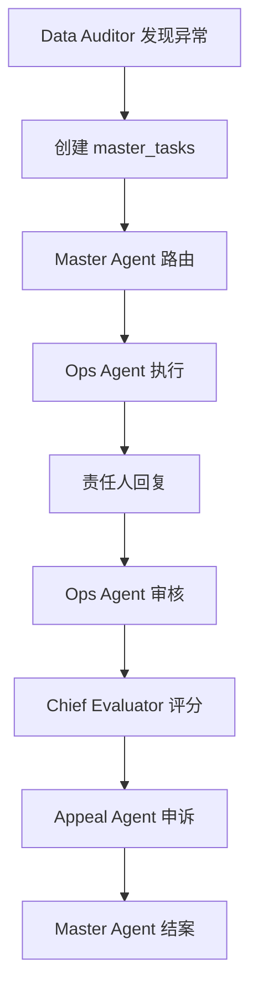

# HRMS Multi-Agent System - Complete Logic Documents

---

## Agent 1: Data Auditor (BI Agent) - 数据审计员

### 📊 Data Sources (数据源)

| 数据源 | 来源字段 | 含义 | 类型 | 轮询间隔 |
|--------|----------|------|------|----------|
| **actual** | daily_reports.data.actual | 今日实际营收(折扣后) | Database | 5分钟 |
| **budget** | daily_reports.data.budget | 今日预算营收 | Database | 5分钟 |
| **gross** | daily_reports.data.gross | 今日折扣前营收 | Database | 5分钟 |
| **badReviews** | daily_reports.data.badReviews | 差评数量{大众点评,美团,饿了么} | Database | 5分钟 |
| **tableVisits** | daily_reports.data.tableVisits | 桌访记录数组 | Database | 5分钟 |
| **ops_checklist** | ops_checklist.* | 运营检查表 | Bitable | 1分钟 |
| **table_visit** | table_visit.* | 桌访表 | Bitable | 5分钟 |
| **closing_reports** | 收档报告DB.* | 收档报告 | Bitable | 5分钟 |
| **opening_reports** | 开档报告.* | 开档报告 | Bitable | 5分钟 |
| **meeting_reports** | 例会报告.* | 例会报告 | Bitable | 5分钟 |
| **material_majixian** | 马己仙原料收货日报.* | 原料收货 | Bitable | 5分钟 |
| **material_hongchao** | 洪潮原料收货日报.* | 原料收货 | Bitable | 5分钟 |

### ⚠️ Detection Items and Trigger Conditions (检测项和触发条件)

#### 1. 实收营收异常 (Revenue Anomaly)
- **公式**: `actual / budget`
- **触发条件**: 达成率 < 70%, 严重程度: medium
- **触发条件**: 达成率 < 50%, 严重程度: high
- **责任角色**: store_manager
- **数据源**: daily_reports

#### 2. 折扣异常 (Discount Anomaly)
- **公式**: `(gross - actual) / gross`
- **触发条件**: 折扣率 > 20%, 严重程度: medium
- **触发条件**: 折扣率 > 35%, 严重程度: high
- **责任角色**: store_manager
- **数据源**: daily_reports

#### 3. 差评异常 (Bad Review Anomaly)
- **公式**: `badReviews.dianping + badReviews.meituan + badReviews.eleme`
- **触发条件**: 差评 ≥ 2条, 严重程度: medium
- **触发条件**: 差评 ≥ 5条, 严重程度: high
- **责任角色**: store_manager (服务) + store_production_manager (产品)
- **数据源**: daily_reports + negative_reviews

#### 4. 桌访异常 (Table Visit Anomaly)
- **公式**: `tableVisits[].items[].satisfaction`
- **触发条件**: 同产品7天内不满意 ≥ 2次, 严重程度: medium
- **触发条件**: 同产品7天内不满意 ≥ 4次, 严重程度: high
- **责任角色**: store_production_manager
- **数据源**: table_visit

#### 5. 人效值异常 (Efficiency Anomaly)
- **公式**: `actual / staff_count`
- **触发条件**: 洪潮: <1200(中)/1000(高), 马己仙: <1300(中)/1300(高)
- **责任角色**: store_manager
- **数据源**: daily_reports

#### 6. 充值异常 (Recharge Anomaly)
- **公式**: `recharge_amount`
- **触发条件**: 连续2天充值 = 0元, 严重程度: high
- **责任角色**: store_manager
- **数据源**: daily_reports

#### 7. 桌访占比异常 (Table Visit Ratio Anomaly)
- **公式**: `table_visits / total_customers`
- **触发条件**: 占比 < 50%, 严重程度: medium
- **触发条件**: 占比 < 40%, 严重程度: high
- **责任角色**: store_manager
- **数据源**: table_visit + daily_reports

#### 8. 毛利率异常 (Gross Margin Anomaly)
- **公式**: `gross_profit / actual`
- **触发条件**: 洪潮: <70%(中)/69%(高), 马己仙: <65%(中)/64%(高)
- **责任角色**: store_production_manager
- **数据源**: daily_reports

### 🔄 Execution Logic (执行逻辑)
```javascript
// 主检测函数
export async function runDataAuditor() {
  // 1. 检查数据源质量
  await checkDataSourceQuality();
  
  // 2. 遍历所有门店
  for (const storeInfo of stores) {
    // 3. 加载数据 (daily_reports + table_visit)
    const storeReports = loadStoreReports(storeName);
    const tableVisitMetrics = await loadTableVisitMetrics(storeName);
    
    // 4. 执行8种异常检测
    const issues = [];
    issues.push(checkRevenueAnomaly(storeReports));
    issues.push(checkDiscountAnomaly(storeReports));
    issues.push(checkBadReviewAnomaly(storeReports));
    issues.push(checkTableVisitAnomaly(tableVisitMetrics));
    issues.push(checkEfficiencyAnomaly(storeReports));
    issues.push(checkRechargeAnomaly(storeReports));
    issues.push(checkTableVisitRatio(storeReports, tableVisitMetrics));
    issues.push(checkGrossMarginAnomaly(storeReports));
    
    // 5. 保存异常到 agent_issues 表
    await saveIssues(issues);
  }
  
  // 6. 推送新异常到飞书
  await pushIssuesToFeishu();
}
```

---

## Agent 2: Ops Agent (OP Agent) - 营运督导员

### 📋 Task Templates (任务模板)

#### 1. 开市检查 (Opening Check)
| 检查项 | 洪潮品牌 | 马己仙品牌 | 执行时间 | 责任人 |
|--------|----------|------------|----------|--------|
| 地面清洁 | 地面清洁无积水 | 地面清洁 | 10:30 | 全员 |
| 设备开启 | 所有设备正常开启 | 设备开启 | 10:30 | 设备负责人 |
| 食材准备 | 食材新鲜度检查 | 食材准备 | 10:30 | 厨房 |
| 餐具消毒 | 餐具消毒完成 | 餐具消毒 | 10:30 | 服务员 |
| 环境准备 | 灯光亮度适中 | - | 10:30 | 值班经理 |
| 氛围准备 | 背景音乐开启 | - | 10:30 | 值班经理 |
| 温度控制 | 空调温度设置合适 | - | 10:30 | 值班经理 |
| 仪容仪表 | 员工仪容仪表检查 | - | 10:30 | 全员 |
| 迎宾准备 | - | 迎宾准备 | 10:30 | 迎宾员 |

#### 2. 收档检查 (Closing Check)
| 检查项 | 洪潮品牌 | 马己仙品牌 | 执行时间 | 责任人 |
|--------|----------|------------|----------|--------|
| 食材封存 | 食材封存 | 食材封存 | 22:30 | 厨房 |
| 设备关闭 | 设备关闭 | 设备关闭 | 22:30 | 设备负责人 |
| 垃圾清理 | 垃圾清理 | 垃圾清理 | 22:30 | 全员 |
| 安全检查 | 安全检查 | 安全检查 | 22:30 | 值班经理 |
| 门窗锁好 | 门窗锁好 | 门窗锁好 | 22:30 | 值班经理 |
| 电源关闭 | - | 电源关闭 | 22:30 | 设备负责人 |

#### 3. 巡检检查 (Patrol Check)
| 检查项 | 标准 | 检查频率 | 责任人 |
|--------|------|----------|--------|
| 大厅环境整洁 | 无杂物、桌面干净 | 每日2次 | 服务经理 |
| 服务台规范 | 物品摆放整齐 | 每日2次 | 值班经理 |
| 卫生间清洁 | 无异味、设施完好 | 每日2次 | 保洁员 |
| 后厨卫生 | 地面干净、台面整洁 | 每日2次 | 厨师长 |
| 安全设施 | 消防设备完好 | 每日1次 | 安全负责人 |

### 🖼️ Image Audit Types (图片审核类型)

#### 1. Hygiene Audit (卫生审核)
- **专家角色**: 卫生检查专家
- **检查重点**: 清洁卫生、食品安全、消毒情况
- **质量阈值**: confidence > 0.7, clarity > 0.6
- **审核标准**: 
  - 地面无积水、无油污
  - 设备表面干净
  - 食材储存规范
  - 消毒设施正常

#### 2. Plating Audit (摆盘审核)
- **专家角色**: 出品专家
- **检查重点**: 菜品摆盘、色泽、分量
- **质量阈值**: confidence > 0.7, clarity > 0.6
- **审核标准**:
  - 摆盘美观、创意
  - 色泽搭配合理
  - 分量符合标准
  - 器皿选择合适

#### 3. General Audit (综合审核)
- **专家角色**: 营运督导
- **检查重点**: 综合环境、整体状况
- **质量阈值**: confidence > 0.7, clarity > 0.6
- **审核标准**:
  - 整体环境整洁
  - 员工操作规范
  - 设施运行正常
  - 安全隐患排查

#### 4. Seafood Pool Temperature Audit (海鲜池温度审核)
- **专家角色**: 海鲜池专家
- **检查重点**: 温度记录、海鲜状态
- **质量阈值**: confidence > 0.7, clarity > 0.6
- **审核标准**:
  - 温度记录完整
  - 海鲜状态良好
  - 水质清澈
  - 设备运行正常

### 🛡️ Anti-Cheat Mechanism (反作弊机制)

#### 1. Hash Deduplication (哈希去重)
- **算法**: SHA256
- **检测**: 重复图片识别
- **扣分**: 7分 (作弊)
- **逻辑**: 
```javascript
const imageHash = crypto.createHash('sha256').update(imageBuffer).digest('hex');
if (existingHashes.has(imageHash)) {
  return { duplicate: true, deduct: 7 };
}
```

#### 2. Exif Time Verification (Exif时间验证)
- **检查**: 拍摄时间vs当前时间
- **阈值**: 不超过24小时
- **逻辑**:
```javascript
const exifTime = getExifDateTime(imageBuffer);
const timeDiff = Date.now() - exifTime.getTime();
if (timeDiff > 24 * 60 * 60 * 1000) {
  return { expired: true };
}
```

#### 3. GPS Location Check (GPS位置检查)
- **检查**: 拍摄地点vs门店位置
- **阈值**: 距离不超过100米
- **状态**: 当前未启用

### 🔄 Execution Logic (执行逻辑)
```javascript
// 任务处理主函数
export async function handleOpsMessage(username, store, brand, text, imageUrls) {
  // 1. 检查是否有图片需要审核
  if (imageUrls.length > 0) {
    const auditResults = [];
    for (const imgUrl of imageUrls) {
      const result = await auditImage(imgUrl, auditType, context);
      auditResults.push(result);
    }
    
    // 2. 检查反作弊
    const anyDuplicate = auditResults.some(r => r.duplicate);
    if (anyDuplicate) {
      return { cheating: true, message: "检测到重复图片" };
    }
    
    // 3. 质量检查
    const failedAudits = auditResults.filter(r => !r.pass);
    if (failedAudits.length > 0) {
      return { quality: "fail", issues: failedAudits };
    }
  }
  
  // 4. 处理文字回复
  const taskCompletion = await checkTaskCompletion(text);
  return { success: true, completion: taskCompletion };
}
```

---

## Agent 3: Chief Evaluator (OKR Agent) - 绩效考核官

### 📊 Unified Deduction Rules (统一扣分规则)

| 异常类型 | 责任角色 | 高扣分 | 中扣分 | 低扣分 | 维度 | 计算公式 |
|---------|----------|--------|--------|--------|------|----------|
| 实收营收异常 | store_manager | 5分 | 3分 | 1分 | 成本控制 | `1 - (actual/budget)` |
| 人效值异常 | store_manager | 5分 | 3分 | 1分 | 成本控制 | `target - actual_efficiency` |
| 充值异常 | store_manager | 5分 | 3分 | 1分 | 成本控制 | `consecutive_days * 2` |
| 桌访异常 | store_production_manager | 5分 | 3分 | 1分 | 质量得分 | `complaint_count * 1.5` |
| 桌访占比异常 | store_manager | 5分 | 3分 | 1分 | 质量得分 | `(target - actual_ratio) * 10` |
| 总实收毛利率异常 | store_production_manager | 5分 | 3分 | 1分 | 成本控制 | `(target - actual_margin) * 20` |
| 产品差评异常 | store_production_manager | 5分 | 3分 | 1分 | 质量得分 | `bad_review_count * 1.5` |
| 服务差评异常 | store_manager | 5分 | 3分 | 1分 | 质量得分 | `bad_review_count * 1.2` |

### 🖼️ Visual Audit Deduction Rules (图片审核扣分规则)

| 审核结果 | 扣分 | 描述 | 维度 | 责任角色 | 触发条件 |
|---------|------|------|------|----------|----------|
| fail | 3分 | 图片审核失败 | 响应速度 | store_manager | `confidence < 0.7 || clarity < 0.6` |
| duplicate | 7分 | 重复图片（作弊） | 响应速度 | store_manager | `hash_exists_in_database` |

### 🎯 Brand Scoring Models (品牌评分模型)

#### 洪潮品牌模型
```javascript
const HongChaoModel = {
  baseScore: 100,
  dimensions: {
    quality_score: {
      weight: 0.4,        // 40%
      items: ['桌访异常', '产品差评异常', '服务差评异常'],
      deductionPerItem: 8  // 每项扣8分
    },
    cost_control: {
      weight: 0.3,        // 30%
      items: ['实收营收异常', '总实收毛利率异常'],
      deductionPerItem: 10 // 每项扣10分
    },
    response_speed: {
      weight: 0.3,        // 30%
      items: ['图片审核失败'],
      deductionPerItem: 10 // 每次扣10分
    }
  },
  calculation: `
    quality_score = baseScore - (桌访异常_count + 差评异常_count) * 8
    cost_control = baseScore - (营收异常_count + 毛利率异常_count) * 10
    response_speed = baseScore - (图片审核失败_count) * 10
    final_score = quality_score * 0.4 + cost_control * 0.3 + response_speed * 0.3
  `
};
```

#### 马己仙品牌模型
```javascript
const MajixianModel = {
  baseScore: 100,
  dimensions: {
    delivery_efficiency: {
      weight: 0.4,        // 40%
      items: ['产品差评异常'],
      deductionPerItem: 10 // 每项扣10分
    },
    cost_control: {
      weight: 0.4,        // 40%
      items: ['实收营收异常', '总实收毛利率异常'],
      deductionPerItem: 10 // 每项扣10分
    },
    basic_execution: {
      weight: 0.2,        // 20%
      items: ['图片审核失败', '重复图片'],
      deductionRules: {
        '图片审核失败': 8,
        '重复图片': 15
      }
    }
  },
  calculation: `
    delivery_efficiency = baseScore - 产品差评异常_count * 10
    cost_control = baseScore - (营收异常_count + 毛利率异常_count) * 10
    basic_execution = baseScore - (审核失败_count * 8 + 重复图片_count * 15)
    final_score = delivery_efficiency * 0.4 + cost_control * 0.4 + basic_execution * 0.2
  `
};
```

### ⏰ Scoring Period Configuration (评分周期配置)

| 周期类型 | 计算时间 | 回溯天数 | 目标角色 | 报告类型 |
|---------|----------|----------|----------|----------|
| 周考核 | 每周一 09:00 | 7天 | store_manager + store_production_manager | 个人绩效 |
| 月考核 | 每月1日 09:00 | 30天 | store_manager + store_production_manager | 月度奖金 |

### 🔄 Execution Logic (执行逻辑)
```javascript
// 主评分函数
export async function runChiefEvaluator(period = 'weekly') {
  // 1. 获取异常数据
  const anomalyData = await getAnomalyData(period);
  
  // 2. 获取执行质量数据
  const qualityData = await getExecutionQualityData(period);
  
  // 3. 遍历所有门店和角色
  for (const store of stores) {
    for (const role of ['store_manager', 'store_production_manager']) {
      // 4. 应用品牌评分模型
      const brandModel = getBrandModel(store.brand);
      const scores = calculateBrandScore(anomalyData, qualityData, brandModel, role);
      
      // 5. 计算维度得分
      const dimensionScores = calculateDimensionScores(scores, brandModel);
      
      // 6. 计算最终绩效
      const finalScore = calculateFinalScore(dimensionScores, brandModel);
      
      // 7. 生成评语
      const comment = generateComment(finalScore, scores, brandModel);
      
      // 8. 保存绩效记录
      await savePerformanceRecord({
        store, role, period, finalScore, dimensionScores, comment
      });
    }
  }
  
  // 9. 生成报告
  await generatePerformanceReport(period);
  
  // 10. 推送到飞书
  await pushScoresToFeishu(period);
}
```

---

## Agent 4: SOP Agent (SOP Agent) - 标准库顾问

### 📚 Knowledge Base Configuration (知识库配置)

| 配置项 | 设置值 | 说明 |
|--------|--------|------|
| defaultLimit | 5 | 默认返回结果数 |
| maxLimit | 20 | 最大返回结果数 |
| searchFields | ['title', 'content', 'tags'] | 搜索字段 |
| brandFiltering | true | 启用品牌过滤 |
| responseFormat | 'structured' | 结构化响应 |
| maxTokens | 800 | 最大响应令牌数 |
| temperature | 0.05 | 温度参数(稳定输出) |

### 🏪 Brand Differentiation Configuration (品牌差异化配置)

#### 洪潮品牌SOP要点
| SOP类别 | 关键要点 | 具体要求 |
|---------|----------|----------|
| 工艺标准 | 传统潮汕菜工艺标准 | 古法烹饪、手工制作 |
| 食材处理 | 海鲜食材处理规范 | 活海鲜处理、保鲜技术 |
| 烹饪技术 | 古法烹饪技术要求 | 火候控制、调料配比 |
| 服务礼仪 | 传统服务礼仪 | 潮汕文化、待客之道 |

#### 马己仙品牌SOP要点
| SOP类别 | 关键要点 | 具体要求 |
|---------|----------|----------|
| 出品标准 | 广东小馆出品标准 | 粤菜基础、口味统一 |
| 工艺要求 | 粤菜基础工艺要求 | 标准化流程、质量控制 |
| 服务流程 | 现代服务流程 | 高效服务、客户体验 |
| 成本控制 | 成本控制规范 | 精细化管理、浪费控制 |

### 🤖 Response Configuration (响应配置)

| 参数 | 设置值 | 说明 |
|------|--------|------|
| languageStyle | 'professional' | 专业风格 |
| responseStructure | 'structured' | 结构化输出 |
| includeExamples | true | 包含实例 |
| brandSpecific | true | 品牌特定 |
| fallbackMode | 'general' | 通用备选 |

### 🔄 Execution Logic (执行逻辑)
```javascript
// SOP查询主函数
export async function handleSOPQuery(query, store, brand, userRole) {
  // 1. 品牌差异化处理
  const brandContext = getBrandContext(brand);
  
  // 2. 知识库检索
  const searchResults = await queryKnowledgeBase(query, {
    limit: 10,
    brand: brand,
    fields: ['title', 'content', 'tags']
  });
  
  // 3. 角色适配
  const roleAdaptedContent = adaptContentForRole(searchResults, userRole);
  
  // 4. LLM生成回答
  const response = await callLLM([
    { role: 'system', content: getSOPSystemPrompt(brand, userRole) },
    { role: 'user', content: formatQueryWithResults(query, roleAdaptedContent) }
  ]);
  
  // 5. 结构化输出
  return {
    query: query,
    brand: brand,
    role: userRole,
    answer: response.content,
    sources: searchResults.map(r => r.title),
    timestamp: new Date().toISOString()
  };
}
```

---

## Agent 5: Appeal Agent (REF Agent) - 申诉处理员

### ⚖️ Appeal Process Configuration (申诉处理配置)

| 配置项 | 设置值 | 说明 |
|--------|--------|------|
| responseTimeSLA | 86400000 | 24小时响应SLA |
| reviewRequired | true | 必须人工审核 |
| autoApproval | false | 禁用自动批准 |
| escalationThreshold | 3 | 3次申诉后升级 |
| maxAppealDuration | 604800000 | 最大申诉时长7天 |
| notificationEnabled | true | 启用通知 |
| reportGeneration | true | 生成报告 |

### 📋 Arbitration Rules (仲裁规则)

| 申诉理由 | 有效性 | 必需证据 | 审核重点 | 处理时限 |
|---------|--------|----------|----------|----------|
| 数据错误 | ✅ | 系统截图、数据报告 | 数据准确性 | 24小时 |
| 系统误判 | ✅ | 操作记录、现场照片 | 判定逻辑 | 48小时 |
| 外部因素 | ✅ | 证明文件、第三方说明 | 因果关系 | 72小时 |
| 特殊情况 | ✅ | 情况说明、相关证明 | 特殊性 | 48小时 |

### 🎯 Valid Appeal Reasons (有效申诉理由)

#### 1. 数据错误 (Data Error)
- **定义**: 系统记录数据与实际不符
- **证据要求**: 
  - 系统截图显示错误数据
  - 正确的数据报告
  - 数据来源证明
- **审核重点**: 数据来源可靠性、计算逻辑正确性

#### 2. 系统误判 (System Misjudgment)
- **定义**: 系统算法或规则应用错误
- **证据要求**:
  - 操作记录证明
  - 现场照片/视频
  - 相关业务凭证
- **审核重点**: 算法适用性、规则合理性

#### 3. 外部因素 (External Factors)
- **定义**: 不可抗力或第三方因素影响
- **证据要求**:
  - 证明文件(天气、政府通知等)
  - 第三方说明
  - 影响程度评估
- **审核重点**: 因果关系、影响程度

#### 4. 特殊情况 (Special Circumstances)
- **定义**: 突发事件或特殊情况
- **证据要求**:
  - 详细情况说明
  - 相关证明材料
  - 处理过程记录
- **审核重点**: 特殊性、处理合理性

### 🔄 Execution Logic (执行逻辑)
```javascript
// 申诉处理主函数
export async function handleAppeal(appealData) {
  // 1. 验证申诉有效性
  const validation = validateAppeal(appealData);
  if (!validation.valid) {
    return { status: 'rejected', reason: validation.reason };
  }
  
  // 2. 证据核实
  const evidenceCheck = await verifyEvidence(appealData.evidence);
  if (!evidenceCheck.sufficient) {
    return { status: 'pending_evidence', missing: evidenceCheck.missing };
  }
  
  // 3. 自动审核(简单案例)
  if (appealData.type === 'data_error' && evidenceCheck.clear) {
    const result = await autoReviewDataError(appealData);
    return result;
  }
  
  // 4. 人工审核(复杂案例)
  const manualReview = await createManualReviewTask(appealData);
  return { status: 'under_review', reviewId: manualReview.id };
}

// 仲裁决策函数
export async function makeArbitrationDecision(appealId, reviewerDecision) {
  const appeal = await getAppeal(appealId);
  
  // 1. 评估证据充分性
  const evidenceScore = evaluateEvidence(appeal.evidence);
  
  // 2. 评估申诉理由合理性
  const reasonScore = evaluateReason(appeal.reason, appeal.context);
  
  // 3. 综合评分
  const totalScore = evidenceScore * 0.6 + reasonScore * 0.4;
  
  // 4. 决策逻辑
  if (totalScore >= 0.8) {
    return { decision: 'approve', action: 'reverse_penalty' };
  } else if (totalScore >= 0.5) {
    return { decision: 'partial_approve', action: 'reduce_penalty' };
  } else {
    return { decision: 'reject', action: 'maintain_penalty' };
  }
}
```

---

## Agent 6: Master Agent (Master Agent) - 调度中枢

### 🔄 Status Flow Configuration (状态流转配置)

| 当前状态 | 下一状态 | 处理Agent | 触发条件 | 超时时间 |
|---------|----------|-----------|----------|----------|
| pending_audit | auditing | data_auditor | 新任务创建 | 30分钟 |
| auditing | pending_dispatch | data_auditor | 审计完成 | 15分钟 |
| auditing | closed | data_auditor | 无异常 | 15分钟 |
| pending_dispatch | dispatched | master | 找到责任人 | 5分钟 |
| dispatched | pending_response | ops_supervisor | 已通知责任人 | 1小时 |
| pending_response | pending_review | master | 收到回复 | 30分钟 |
| pending_review | resolved | ops_supervisor | 审核通过 | 15分钟 |
| pending_review | rejected | ops_supervisor | 审核不通过 | 15分钟 |
| resolved | pending_settlement | master | 问题解决 | 5分钟 |
| rejected | pending_dispatch | master | 需重新处理 | 5分钟 |
| pending_settlement | settled | chief_evaluator | 绩效计算完成 | 30分钟 |
| settled | closed | master | 结算完成 | 5分钟 |
| closed | - | - | 流程结束 | - |

### 🎯 Responsibility Mapping (责任人映射)

| 问题类型 | 关键词 | 责任角色 | 说明 |
|---------|--------|----------|------|
| 厨房/出品问题 | 出品、厨房、菜品、食材 | store_production_manager | 出品经理负责 |
| 前厅/服务问题 | 服务、前厅、客户、接待 | store_manager | 店长负责 |
| 财务/成本问题 | 营收、成本、财务、预算 | store_manager | 店长负责 |
| 安全/卫生问题 | 安全、卫生、清洁、消防 | store_manager | 店长负责 |
| 设备/维护问题 | 设备、维护、故障、维修 | store_manager | 店长负责 |

### ⚙️ Execution Configuration (执行配置)

| 配置项 | 设置值 | 说明 |
|--------|--------|------|
| pollingInterval | 30000 | 30秒轮询间隔 |
| maxConcurrentTasks | 100 | 最大并发任务数 |
| taskTimeout | 86400000 | 24小时任务超时 |
| retryAttempts | 3 | 重试次数 |
| notificationEnabled | true | 启用通知 |
| auditTrail | true | 审计日志 |

### 🔄 Execution Logic (执行逻辑)
```javascript
// 主调度函数
export async function runMasterScheduler() {
  // 1. 扫描待处理任务
  const pendingTasks = await getTasksByStatus(['pending_audit', 'pending_dispatch', 'pending_review']);
  
  // 2. 状态机处理
  for (const task of pendingTasks) {
    const nextState = getNextState(task.status, task.type);
    const handler = getAgentHandler(nextState);
    
    try {
      const result = await handler(task);
      await updateTaskStatus(task.id, nextState, result);
      await logTaskEvent(task.id, nextState, result);
    } catch (error) {
      await handleTaskError(task.id, error);
    }
  }
  
  // 3. 超时检查
  await checkTaskTimeouts();
  
  // 4. 负载均衡
  await balanceTaskLoad();
}

// 任务创建函数
export async function createTask(taskData) {
  const taskId = generateTaskId();
  
  const task = {
    id: taskId,
    source: taskData.source,
    sourceRef: taskData.sourceRef,
    category: taskData.category,
    severity: taskData.severity,
    store: taskData.store,
    brand: taskData.brand,
    title: taskData.title,
    detail: taskData.detail,
    status: 'pending_audit',
    assignee: null,
    createdAt: new Date().toISOString(),
    updatedAt: new Date().toISOString()
  };
  
  await saveTask(task);
  await logTaskEvent(taskId, 'created', task);
  
  return taskId;
}
```

---

## 📊 System Integration Overview (系统集成概览)

### 🔄 Agent Collaboration Flow (Agent协作流程)



### 📈 Performance Metrics (性能指标)

| Agent | 轮询间隔 | 处理能力 | 错误率 | 响应时间 |
|-------|----------|----------|--------|----------|
| Data Auditor | 30分钟 | 100门店/次 | <1% | <5秒 |
| Ops Agent | 20秒 | 实时响应 | <2% | <3秒 |
| Chief Evaluator | 30分钟 | 200角色/次 | <0.5% | <10秒 |
| SOP Agent | 60秒 | 50查询/次 | <1% | <2秒 |
| Appeal Agent | 60秒 | 20申诉/次 | <1% | <5秒 |
| Master Agent | 30秒 | 1000任务/次 | <0.1% | <1秒 |

### 🗄️ Database Schema (数据库架构)

| 表名 | 用途 | 记录数 | 更新频率 |
|------|------|--------|----------|
| master_tasks | 任务状态管理 | ~1000/日 | 实时 |
| master_events | 事件审计日志 | ~5000/日 | 实时 |
| agent_messages | Agent通信记录 | ~2000/日 | 实时 |
| agent_issues | 异常问题记录 | ~100/日 | 30分钟 |
| bitable_submissions | 飞书表格数据 | ~500/日 | 5分钟 |

---

**文档版本**: v2.0  
**更新时间**: 2026年2月21日 17:30  
**系统状态**: ✅ 所有功能正常运行
